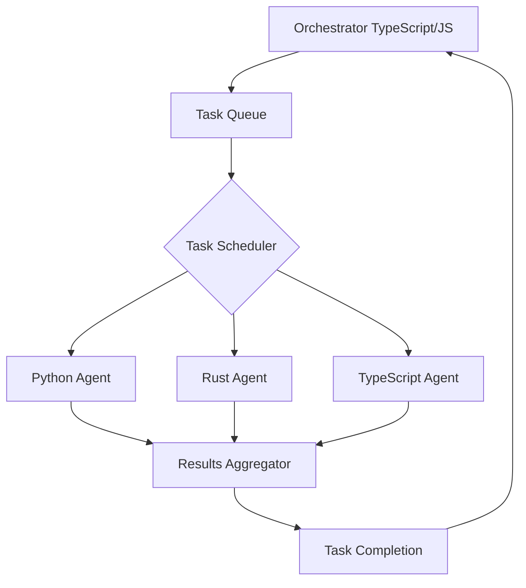
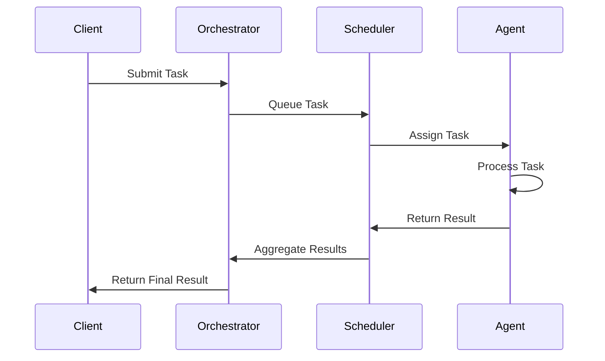
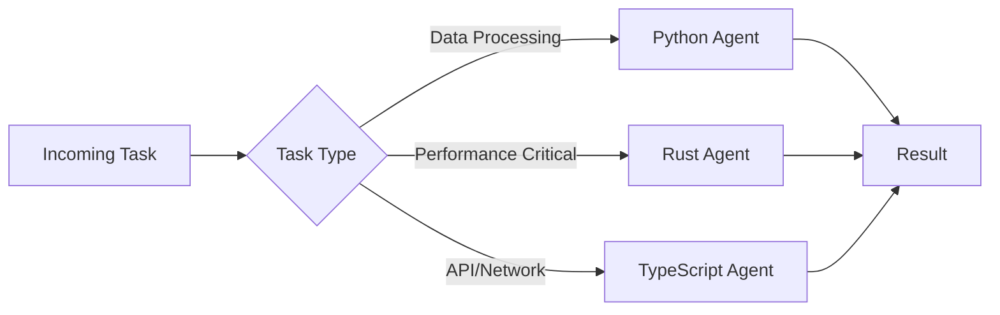
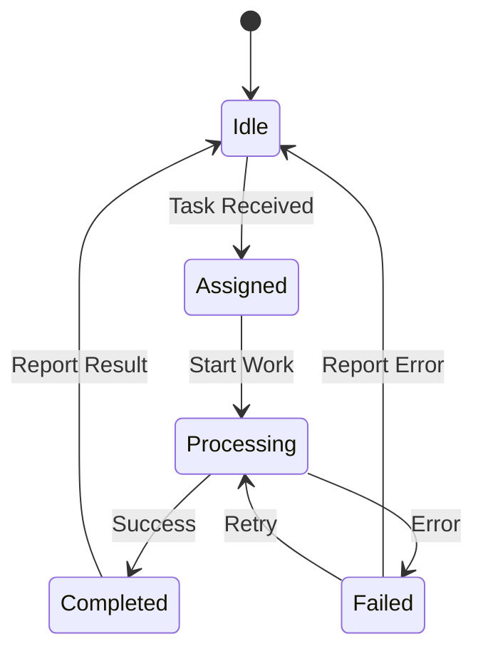
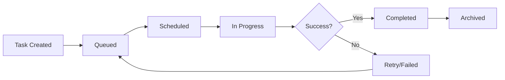
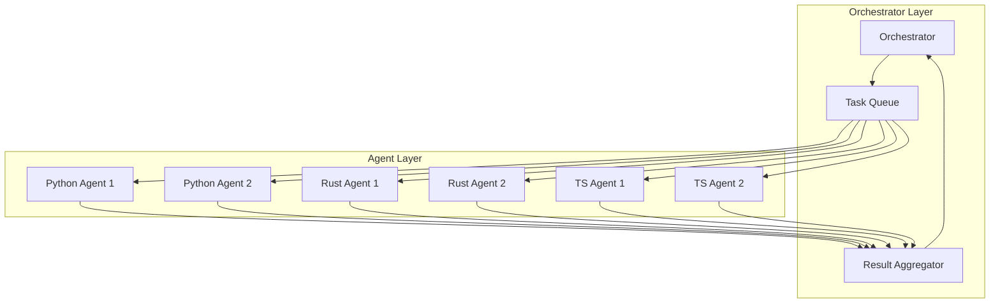

# AgentLab - Multi-Agent Collaboration and Scheduling System

AgentLab is a distributed multi-agent collaboration system that enables multiple agents written in different programming languages (TypeScript, Python, Rust) to work together on complex tasks through a centralized orchestrator.

## Architecture Overview



## System Components

### 1. Orchestrator (TypeScript/JavaScript)
The central coordinator that:
- Receives incoming tasks
- Manages the task queue
- Delegates tasks to appropriate agents
- Aggregates results



### 2. Task Scheduler
Intelligent task distribution based on:
- Agent capabilities
- Current load
- Task priority
- Agent language specialization



### 3. Agent Workers

#### Python Agent
- Data processing and analysis
- Machine learning tasks
- Scientific computing

#### Rust Agent
- High-performance computing
- Systems-level operations
- Memory-efficient processing

#### TypeScript/JavaScript Agent
- API integrations
- Web services
- Asynchronous operations

## Agent Communication Protocol



## Task Lifecycle



## Multi-Agent Collaboration Flow



## Features

- 🔄 **Multi-language support**: Agents in TypeScript, Python, and Rust
- 📊 **Intelligent scheduling**: Dynamic task distribution based on agent capabilities
- 🔗 **Inter-agent communication**: Standardized protocol for agent communication
- ⚡ **High performance**: Rust agents for performance-critical tasks
- 🐍 **Data processing**: Python agents for data analysis and ML
- 🌐 **API integration**: TypeScript agents for web services
- 📈 **Scalable**: Easily add more agents as needed
- 🔍 **Monitoring**: Built-in task tracking and result aggregation

## Getting Started

### Prerequisites
- Node.js 18+ and pnpm
- Python 3.9+
- Rust 1.70+

### Installation

```bash
# Install dependencies
pnpm install

# Build all packages
pnpm build

# Start the system
pnpm dev
```

### Quick Example

```typescript
// Submit a task to the orchestrator
const task = {
  id: 'task-001',
  type: 'data-processing',
  payload: { data: [...] }
};

const result = await orchestrator.submitTask(task);
```

## Project Structure

```
AgentLab/
├── packages/
│   ├── orchestrator/        # TypeScript orchestrator
│   ├── typescript-agent/    # TypeScript agent worker
│   ├── python-agent/        # Python agent worker
│   └── rust-agent/          # Rust agent worker
├── docs/                    # Documentation
├── package.json
└── pnpm-workspace.yaml
```

## License

MIT