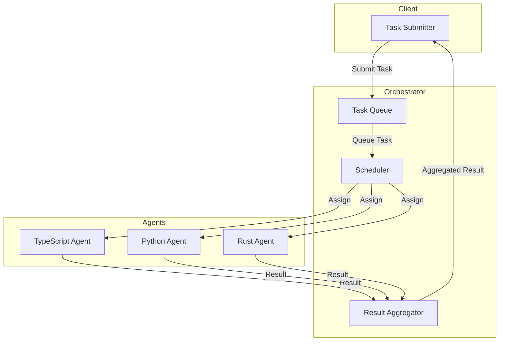
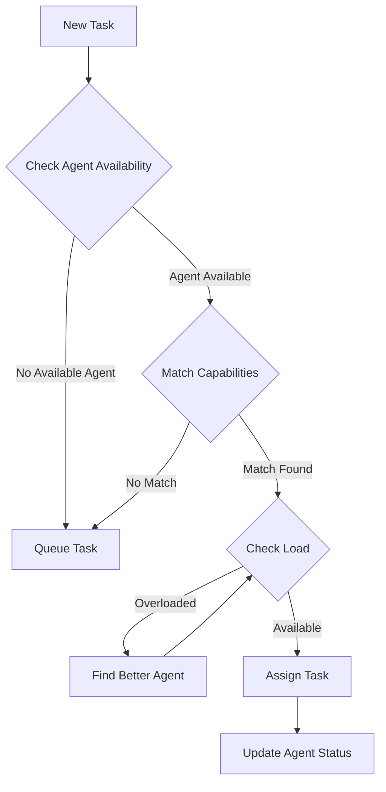
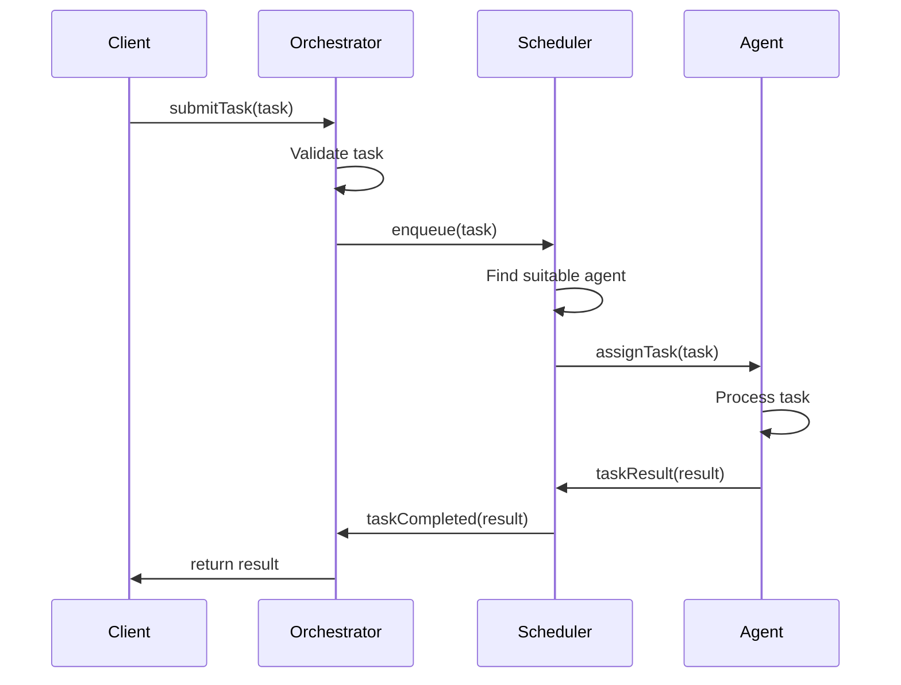
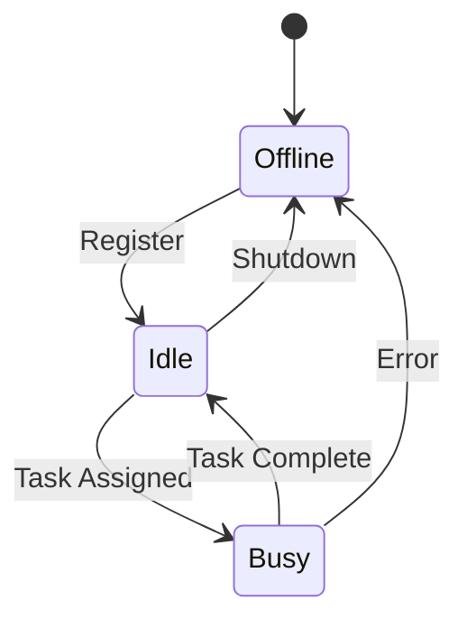
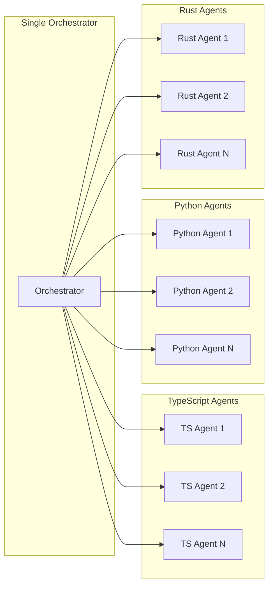
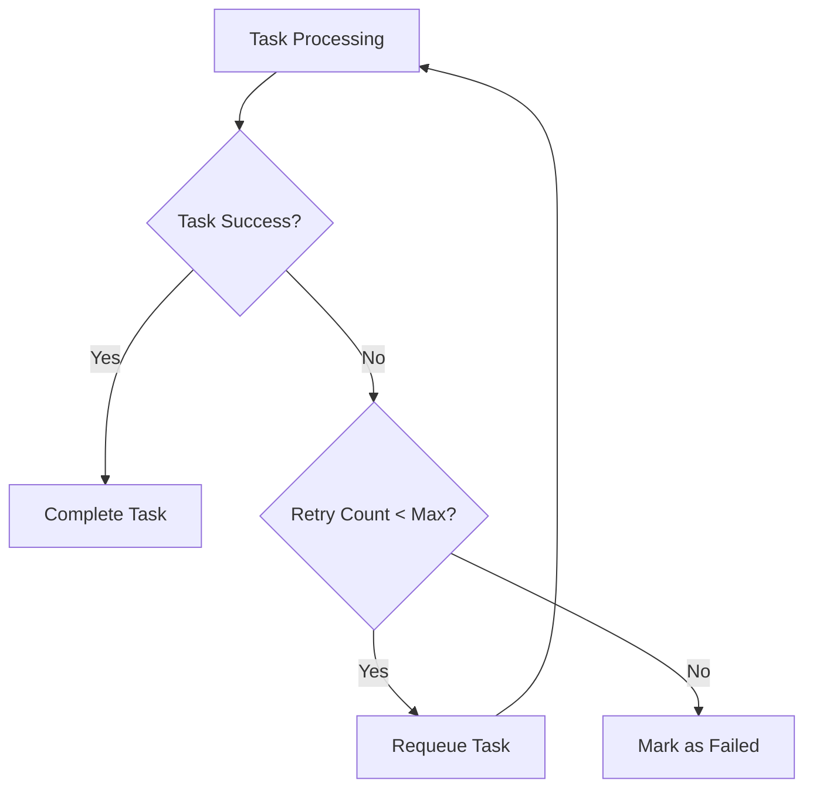

# Multi-Agent Architecture

## Overview

AgentLab implements a distributed multi-agent system where agents written in different programming languages collaborate to process tasks efficiently.

## Architecture Diagram



## Components

### 1. Orchestrator

The orchestrator is the central coordinator written in TypeScript. It manages:

- **Task Queue**: Maintains a priority queue of pending tasks
- **Scheduler**: Intelligently assigns tasks to agents based on capabilities and load
- **Result Aggregator**: Collects and aggregates results from agents

#### Responsibilities:
- Accept task submissions from clients
- Queue tasks with priorities
- Track agent capabilities and status
- Schedule tasks to appropriate agents
- Aggregate and return results

### 2. Task Scheduler

The scheduler implements intelligent task distribution:



#### Scheduling Algorithm:
1. Filter agents by capability (can handle task type)
2. Filter by status (must be idle)
3. Select agent with lowest current load
4. Assign task and update agent status

### 3. Agents

Each agent type specializes in different workloads:

#### TypeScript Agent
- **Specialization**: API calls, network operations, async I/O
- **Use Cases**: 
  - REST API integration
  - WebSocket communication
  - File I/O operations
  - Asynchronous workflows

#### Python Agent
- **Specialization**: Data processing, scientific computing
- **Use Cases**:
  - Data analysis and transformation
  - Machine learning inference
  - Statistical computations
  - Image/text processing

#### Rust Agent
- **Specialization**: High-performance computing, memory efficiency
- **Use Cases**:
  - CPU-intensive calculations
  - Low-latency operations
  - Systems programming tasks
  - Parallel processing

## Communication Protocol



### Message Format

All communication uses JSON format:

```typescript
// Task Message
{
  id: string;
  type: TaskType;
  payload: any;
  priority?: number;
}

// Result Message
{
  taskId: string;
  success: boolean;
  data?: any;
  error?: string;
  completedAt: Date;
}
```

## Agent States



### State Definitions:
- **Offline**: Agent is not available for work
- **Idle**: Agent is available and waiting for tasks
- **Busy**: Agent is currently processing a task

## Scalability

The system is designed to scale horizontally:



### Scaling Strategies:
1. **Vertical Scaling**: Add more agents of each type
2. **Horizontal Scaling**: Distribute orchestrator load
3. **Load Balancing**: Intelligent task distribution based on agent metrics

## Fault Tolerance



### Error Handling:
- Task retry mechanism with configurable max attempts
- Agent health monitoring
- Automatic task reassignment on agent failure
- Graceful degradation when agents are unavailable

## Performance Considerations

1. **Task Prioritization**: Higher priority tasks are scheduled first
2. **Load Balancing**: Tasks distributed based on agent load
3. **Concurrent Processing**: Multiple agents process tasks in parallel
4. **Efficient Queuing**: O(log n) enqueue/dequeue operations

## Future Enhancements

1. **Distributed Orchestrator**: Multiple orchestrator instances for high availability
2. **Dynamic Agent Discovery**: Auto-discovery of new agents
3. **Advanced Scheduling**: ML-based task-to-agent matching
4. **Monitoring Dashboard**: Real-time system metrics and visualization
5. **Task Dependencies**: Support for task dependency graphs
6. **Result Caching**: Cache results for idempotent tasks
